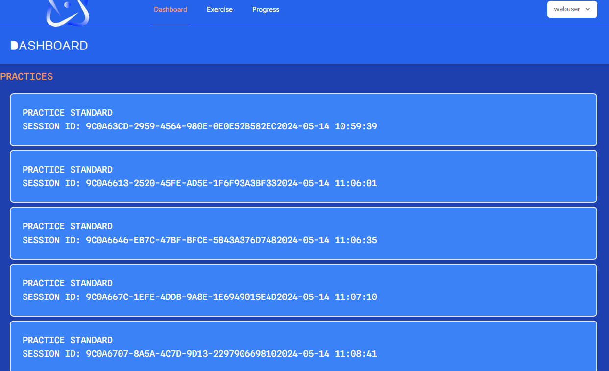

# Arithmetic Trainer

## Overview

Arithmetic Trainer is a web application designed to help users improve their arithmetic skills through practice and repetition. Built using Laravel for the backend and React for the frontend, this application provides users with customizable arithmetic exercises and tracks their progress over time.

## Features

- User authentication: Allow users to sign up, log in, and manage their accounts securely.
- Arithmetic practice: Generate randomized arithmetic questions based on user preferences (operations and difficulty level).
- Feedback and scoring: Provide immediate feedback on answers and track user scores.
- Progress tracking: Keep track of user progress over time, including statistics such as accuracy and average response time.
- Leaderboard: Display top performers to encourage competition among users.
- Responsive design: Ensure the application works well on different devices.
- Accessibility: Make the application accessible to users with disabilities.
- Feedback mechanism: Allow users to provide feedback or suggestions for improvement.
- Admin panel (optional): Create an admin panel for managing users and viewing statistics.

## Technologies Used

- [Laravel](https://laravel.com/docs/11.x)
- [React (inertia)](https://inertiajs.com/)
- [Postgresql](https://www.postgresql.org/docs/)
- [Tailwind CSS](https://tailwindcss.com/docs/installation)
- [Storybook](https://storybook.js.org/docs/get-started)
- [Statamic](https://statamic.dev/installing)

## Getting Started

To get started with development, follow these steps:

1. Clone the repository: `git clone <repository-url>`
2. Navigate to the project directory: `cd arithmetic-trainer`
3. Install backend dependencies: `composer install`
4. Install frontend dependencies: `npm install`
5. Set up environment variables:
   - Create a `.env` file based on the `.env.example` template.
   - Configure database connection settings.
6. Generate application key: `php artisan key:generate`
7. Migrate and seed the database: `php artisan migrate --seed`
8. Start the development server:
   - Backend: `php artisan serve`
   - Frontend: `npm start`
9. Access the application in your browser: `http://localhost:8000`

## Database

## Arithmetic Trainer User Experience Flowchart

### User Experience Flow

<!-- TODO Update Flow Chart -->

## Arithmetic Trainer Screen Shots

### Title Screen

### Registration Screen

### Login Screen

### Dashboard

### Exercise Select Screen

### Exercise Settings Screen

### Exercise Start Screen

<!-- TODO Add remaing page screen shots -->

<!-- TODO Add backend route docs -->

## Contact

If you have any questions or suggestions, please feel free to reach out to [Vincent Radford](mailto:vmradford@gmail.com).
